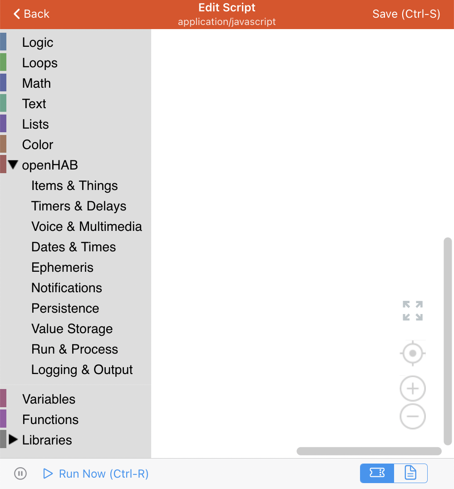
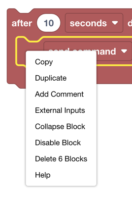

<!-- markdownlint-disable MD036 -->

# Before using blockly in openHAB

[return to Blockly Reference](index.html#before-using-blockly)

## Preface

Blocklies are an easy entry to the world of writing rules.
However, after some times, you end up writing more and more complex rules, so more sooner than later you will encounter some challenges.
This section intends to provide some hints to get started and how to deals with those challenges.
Please read them carefully before asking questions in the forum.

[[toc]]

## **openHAB Configuration Files**

Some openHAB blocks rely on particular configuration files found in the openHAB configuration folder.
This folder is referred to as $OPENHAB\_CONF in this page, and the location of this folder for your setup can be found via the UI: _Help & About_ -> _Technical Information_ -> _Configuration folder_.

- via mounting the files shares from the server to your client-PC.
In the main UI as an admin you can go to _Help & About_ and will have the different folder locations under _Technical information_.
  - the exact configuration of the shares can be found on your server at [/etc/samba/smb.conf](https://github.com/openhab/openhabian/blob/main/includes/smb.conf).
- Use the share _openHAB_-conf when mounting it from Windows or macOS

**Link the openHAB share in Windows**

- Find you openHAB-Server via the network share functionality
- User the share _openHAB_-conf to assign it to a network drive

**Link the openHAB share in macOS**

- Finder -> Go -> Connect to Server
  - Enter the username and server name to connect to the openHAB Server

  
  - then choose the folder you want to mount

  

**Finding it on Linux**

- Access the folder directly on the openHAB server at _/etc/openhab_

All methods reveal the following folders

- html
- icons
- items
- services
- html
- persistence
- rules
- scripts
- sitemaps
- sounds
- things
- transform

## Creating a blockly rule via the UI

Also view  [Creating a Blockly Rule](https://youtu.be/EdllUlJ7p6k?t=429)

- go to Settings -> Rules
- press  on bottom right
- enter a unique id and rule name for your new blockly rule
- Under "When" click on "Add Trigger" to define a trigger for the rule (you may add multiple triggers which are perceived as any of those triggers may occurs which stands for an OR combination of the triggers)
  - choose a title for the rule
  - choose "item" (or something else) that should trigger the rule
  - select the item from your model and the click PICK on the upper right corner
  - choose "received a command", "was updated" or "changed"
- Under "Then" click on "Add Action"
- choose 
- click on  und you should now see this screen
  
- you can now click the  to access all openHAB Blocks.
- Drag and Drop the blocks to the white area
- Press `Ctrl-s` (Windows) or `Command-s` (macOS) to save your rule
- Press `Ctrl-r` (Windows) or `Command-r` (macOS) to directly run your rule with the trigger
- Press `Ctrl-d` (Windows) or `Command-d` (macOS) to disable / enable your rule.
See the following video on  [How to disable Rules](https://youtu.be/hSRfooBKn9A?t=1668)
- **Click on**  **on the lower right of the bottom toolbar to see the generated code** and will transition to (click again to come back to the blocks).

More about the topic of code generation can be viewed at  [Blockly as an ECMA-Script code generator](https://youtu.be/EdllUlJ7p6k?t=1739)

### Panning and Zooming

You can move around Blockly's workspace by clicking and dragging on the empty space, or by using two fingers on a touch screen or a trackpad.

Zooming can be done using either of these methods:

- By pinching or stretching on a touch screen or a trackpad.
- By holding <kbd>Ctrl</kbd> while dragging or moving with two fingers on the touch screen or trackpad.
- With the on-screen controls:
  
  

### Context Menu

A context menu is available when right-clicking on a block.

Right-clicking on an empty area in the workspace will pop up a slightly different context menu.
In particular, `Clean up Blocks` will automatically move and arrange your blocks neatly.

### Selecting Blocks

Click on a block to select it.

You can select multiple blocks by holding the <kbd>Shift</kbd> key while clicking on other blocks.
Alternatively, hold down the <kbd>Shift</kbd> key, click on an empty area and start dragging to select the blocks within the selection rectangle.

Child blocks are automatically selected when their parent is selected.

Once selected, the blocks can be copied, duplicated, deleted, or moved around.

### Copying & Pasting

Copy-pasting can be used as a quick way to duplicate a set of blocks within the same script.
You can also copy a set of blocks into your clipboard, and paste them into another script.

### Other Operations

- **Duplicate**: Clones the block
- **Add comment**: Adds a comment to the block
- **Inline Inputs** / External inputs: Switches between horizontal or vertical alignment of inputs

  Inline:
  

  External:
  

- **Collapse (expand) block**: Shrinks the block to get a better overview

  Normal block view:
  

  Collapsed view:

  

- **Disable (enable) block**: Disables the block, so no code is generated and its functionality switched off
- **Delete**: delete the blocks (this can be reverted via Command/Ctrl-Z)

### Searching the workspace

Sometimes blockly rules become pretty big, and it is hard to find particular blocks in the rule.
Therefore, a search functionality has been provided by pressing Cmd/Ctrl-F which opens a small search window in the top right (just below the "save"-label).
After pressing _Enter_ all found blocks that contain the search term are marked in black.

## Use Frontail for viewing log files

During development the log-block is lot very often which writes information into the log files.

- To be able to conveniently view your log files it is recommended to setup _frontail_ which can be achieved easily via [openhabian-config](https://www.openhab.org/docs/installation/openhabian.html#optional-components)
- Start `openhabian-config` on your server and choose option 20 and then option 21
- After installation you can view your logs under [openhabian-config](http://myopenhab-server:9001) (adapt the server name)
- **see [how to log](https://www.openhab.org/docs/administration/logging.html)**

More on that topic can be viewed at  [Logging](https://youtu.be/EdllUlJ7p6k?t=670)

## Show an item status watch list besides the blockly rules

In the developer section there is the possibility to add a sidebar to the blockly rules development workspace that allows to watch live status of an item.
View the chapter  [Debugging Rules with openHAB Developer Tools to watch Item-Status](https://youtu.be/EdllUlJ7p6k?t=325) for more information

## Return to Blockly Reference

[return to Blockly Reference](index.html#before-using-blockly)
